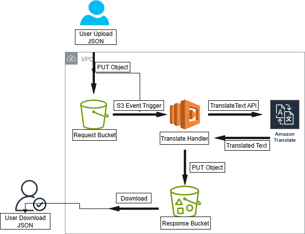

CloudLingo – AWS Translate Automation

Region: us-east-1

Author: Prince Larbi Wireko

Description: An automated translation pipeline using AWS S3, Lambda, and Amazon Translate. Upload a JSON file to the request bucket, and get a translated JSON in the response bucket no manual intervention.

📌 Features

Serverless: Fully managed with AWS Lambda and S3 triggers.

Multi-language: Supports any language pair supported by Amazon Translate.

Automated: Upload → Translate → Output in seconds.

Versioned & Managed: S3 versioning and lifecycle rules for cost optimization.

🛠 Architecture Overview
Code

[User Upload]
|
v
[Request S3 Bucket] --(S3 Event)--> [AWS Lambda] --> [Amazon Translate]
| |
v v
[Response S3 Bucket] <---------------------------------- Translated JSON

📊 AWSIcon Architecture Diagram

💻 Tech Stack

🚀 Quick Start (Cheat Sheet)

1. Deploy Infrastructure
   aws cloudformation deploy \
    --stack-name cloudlingo \
    --template-file infra.yaml \
    --capabilities CAPABILITY_NAMED_IAM \
    --parameter-overrides BucketBaseName=cloudlingo-prince-2025-0902 \
    --region us-east-1

2. Get Resource Names
   aws cloudformation describe-stacks \
    --stack-name cloudlingo \
    --region us-east-1 \
    --query "Stacks[0].Outputs"

📂 Project Structure

.
├── infra.yaml # CloudFormation template
├── translate_lambda.py # Lambda handler
├── translate_local.py # Local test script
├── request_en_fr.json # Sample request
├── assets/
│ └── architecture.png # AWS-icon diagram
└── README.md # This file

🧪 Local Testing (Optional)

1. Create a request JSON
   json
   {
   "sourceLanguageCode": "en",
   "targetLanguageCode": "fr",
   "texts": ["Hello, world!", "How are you today?"],
   "metadata": {"requestId": "demo-001"}
   }

2. Run the script
   python translate_local.py request_en_fr.json <RequestBucketName> <ResponseBucketName>

3. Verify output
   aws s3 ls s3://<ResponseBucketName>/translated/ --region us-east-1
   aws s3 cp s3://<ResponseBucketName>/translated/request_en_fr_to_fr.json . --region us-east-1

⚡ Automated Lambda Flow

1.Upload JSON to Request Bucket (prefix: inbox/ if configured).
2.S3 event triggers Lambda.
3.Lambda calls Amazon Translate.
4.Output JSON saved to Response Bucket.

🛠 Debugging

AWS Console → CloudWatch Logs → /aws/lambda/cloudlingo-translate

Check for:
Permission errors
Wrong bucket names
Missing prefixes

🧹 Cleanup

aws s3 rm s3://<RequestBucketName> --recursive --region us-east-1
aws s3 rm s3://<ResponseBucketName> --recursive --region us-east-1
aws cloudformation delete-stack --stack-name cloudlingo --region us-east-1

💡 Next Steps

Add a simple web UI for uploads (S3 static site + API Gateway).

Batch process multiple files via SQS.

Tag S3 objects with language codes for easy filtering.
